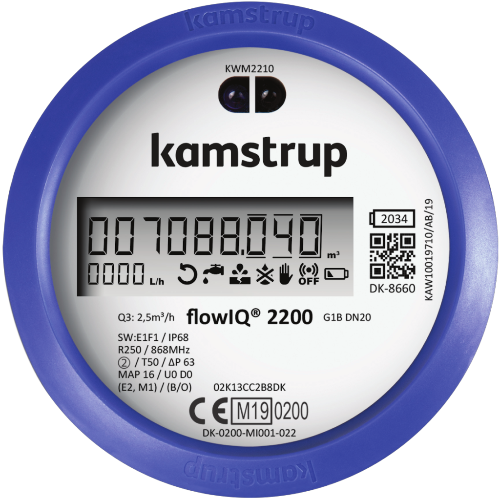

# WaterMeter-FlowIQ2200 (ESP32 + CC1101 + Home Assistant MQTT Discovery)

ESP32 + CC1101 receiver for Kamstrup FlowIQ 2200 (Wireless M-Bus). Publishes meter data via MQTT for Home Assistant.

Read **Kamstrup FlowIQ 2200** (wM-Bus) using an **ESP32 + CC1101**, publish values over **MQTT**, and let **Home Assistant** create the device + sensors automatically via **MQTT Discovery**.

---

## What you get in Home Assistant

A single MQTT device with sensors such as:

- **Water Meter Usage** (m³) – total consumption
- **Water Meter Month Start Value** (m³) – month baseline
- **Water Meter Flow** (l/h) – current flow as an **integer l/h**

## Status
- Works with FlowIQ 2200 telegrams where AES key and meter ID are known.
- Publishes JSON to MQTT for easy HA sensors.

## License
This project is **GNU GPL v3 (or later)**.  
Original codebase: https://github.com/pthalin/esp32-multical21  
See: `LICENSE` and `CREDITS.md`.

**Important:** Original copyright headers are preserved in derived files.  
All modifications are marked with: `modified by erikxson, 2026:`.

---

# Hardware

- ESP32 Dev board
- CC1101 module (868 MHz)
- Antenna tuned for 868 MHz
- 3.3V power (do NOT use 5V for CC1101)

## Wiring (ESP32 ↔ CC1101)

**Important:** CC1101 is **3.3V only**. Do **not** power it from 5V.

This pin order follows the module silk-screen from **VCC** downward (as on the common green CC1101 boards):

| CC1101 pin (top → bottom) | Connect to ESP32 | Notes |
|---|---|---|
| **VCC** | **3V3** | 3.3V only |
| **GND** | **GND** | common ground |
| **MOSI** | **GPIO 23** | SPI MOSI |
| **SCK/SCLK** | **GPIO 18** | SPI SCK |
| **MISO** | **GPIO 19** | SPI MISO |
| **GDO2** | *(optional / not used)* | leave unconnected unless your build uses it |
| **GDO0** | **GPIO 32** | data/interrupt pin used by firmware |
| **CSN** | **GPIO 4** | SPI CS |

Right-side pads on many modules:

| CC1101 pad | Connection | Notes |
|---|---|---|
| **GND** | GND | (optional) |
| **ANT** | Antenna wire | solder antenna here |
| **GND** | GND | (optional) |

---

# Build & Flash (PlatformIO)

**Open the project in PlatformIO**
- Open VS Code
- Install PlatformIO (Extensions → search “PlatformIO”)
- In VS Code: File → Open Folder… and select the repo folder (watermeter-flowiq2200)
- Wait for PlatformIO to finish indexing dependencies

**Create your credentials file (required)**

- Rename src/credentials.example.h → src/credentials.h
- Fill in:
  - Wi-Fi SSID + password
  - MQTT broker host/IP
  - MQTT username/password (or empty strings if not used)
  - meterId (4 bytes)
  - key (16 bytes AES-128)

**Verify wiring matches the firmware**

- Confirm your wiring matches include/hwconfig.h

**Select build target (ESP32 recommended)**

- ESP32 (tested)
- ESP8266 (experimental / not tested)

**Build the firmware**

- PlatformIO → Project task → "esp-board of your choice" → Build

**Flash the firmware**

- PlatformIO → Project task → "esp-board of your choice" → Upload

**Monitor serial output**

- PlatformIO → Project task → "esp-board of your choice" → Monitor

**Home Assistant: enable MQTT Discovery and verify device appears**

Home Assistant must have the MQTT integration configured and connected to the broker.
Home Assistant must have the MQTT integration configured and connected to the broker.

  Verify in Home Assistant
  - Go to Settings → Devices & Services → MQTT
  - Open the Devices list
  - Look for a new device named similar to: Water Meter / WaterMeter-FlowIQ2200

  You should get sensors such as:
  - Water Meter Usage (m³)
  - Water Meter Month Start (m³)
  - Water Meter Flow (l/h)

**MQTT topics (for verification)**

Go to Settings → Devices & services → MQTT → Settings → Listen to topic
  Start listen to:
  - watermeter/0/sensor/mydatajson
  - watermeter/0/online
  - watermeter/0/online_ts

---

If this project saved you time, consider buying me a coffee

---